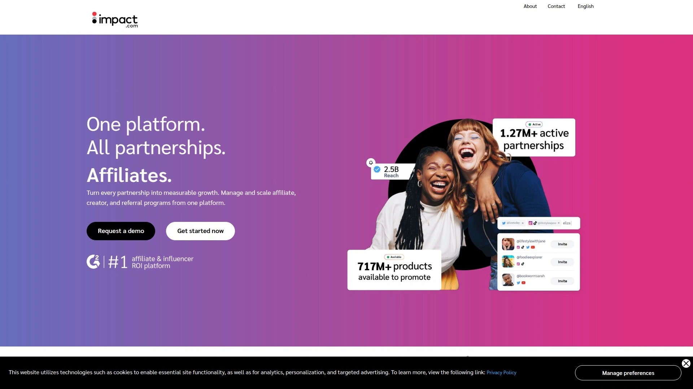

# 2025年排名前15的联盟营销数据聚合工具汇总（最新整理）

面向内容网站主、媒体与应用方，这份清单聚焦**联盟营销数据聚合**与**报表自动化**两大刚需。通过对多网络对接与 API 能力的梳理，帮助你在更短时间完成跨平台数据拉取、分析与可视化，提升投放与内容变现的效率与稳定性。

---

## **[Strackr](<https://strackr.com>)**
一站整合多网络数据与 API 输出，面向媒体、返利与优惠类场景。

- 支持连接大量网络账户，统一汇总统计、广告主状态与优惠信息；
- 仪表盘+细分报表，减少频繁登录各平台；
- 提供 API、链接生成等开发者工具，便于接入内部系统与应用。

## **[impact.com](<https://impact.com/>)**
全流程伙伴管理与归因分析平台，覆盖发现、签约、追踪到结算的闭环。适合成熟团队做规模化合作管理。

- 支持多角色伙伴（创作者、推荐、商务合作等）统一管理；
- 规则化归因与防欺诈能力，提升数据可靠性与风控；
- 面向品牌与发布者均提供工具套件。

## **[CJ](<https://www.cj.com/>)**
全球体量与品牌覆盖领先的合作网络之一，适合内容站、垂直媒体做品牌深度合作与规模化运营。

- 提供面向发布者的管理后台与多维报表；
- 行业与品类覆盖广、可对接丰富广告主资源。

## **[Awin](<https://www.awin.com/us/>)**
全球化网络与工具链齐全，上手流程清晰，适合新老发布者快速起步与扩展。

- 发布者门户与实用指南，降低上手门槛；
- 品牌资源丰富，支持内容电商等多种模式。

## **[Rakuten Advertising](<https://rakutenadvertising.com/publishers/>)**
以发布者体验为中心的管理后台与入驻流程，便于统一管理多品牌合作。

- 注册流程公开透明，适合网站、博客与社媒主体；
- 后台提供链路管理与数据查看。

## **[ShareASale](<https://www.shareasale.com/>)**
老牌平台，提供新手指导与工具，适合内容站、测评与长尾主题站点。

- 完整新手路径与数据报告说明；
- 与 Awin 生态联动。

## **[Partnerize](<https://partnerize.com/>)**
以自动化为核心的伙伴管理平台，覆盖发现、优化与结算，适合品牌与高阶发布者协同。

- 提供端到端工具集与全球化覆盖；
- 面向合作方的入驻与管理入口完善。

## **[Admitad](<https://www.admitad.com/>)**
面向卖家与发布者的协作平台，支持多渠道追踪与多元归因，地域覆盖广。

- 支持内容站、返利、优惠等多类型发布者；
- 提供全漏斗追踪与灵活结算选项。

## **[FlexOffers](<https://www.flexoffers.com/>)**
资源覆盖广、关系深的合作平台，适合需要多行业快速拓展与运营支持的发布者。

- 提供发布者关系支持与运营工具；
- 海量品牌与活动可供选择。

## **[Tradedoubler](<https://www.tradedoubler.com/>)**
欧洲起家的成熟平台，提供发布者注册通道与多市场覆盖。

- 注册与使用流程标准化；
- 面向发布者的增长与转化工具。

## **[Webgains](<https://www.webgains.com/>)**
以技术与培训支持见长，帮助发布者快速开始与持续优化。

- 提供新手上路知识库与步骤指南；
- 多地区网络可选择。

## **[ClickBank](<https://www.clickbank.com/>)**
以数字产品为主的市场型平台，适合内容型发布者做主题化选品与持续运营。

- 提供选品市场、结算与追踪支持；
- 完整新手路径与操作指引。

## **[Sovrn Commerce](<https://www.sovrn.com/commerce/>)**
面向内容电商的工具集，涵盖链接管理、实时比价与智能推荐等能力。

- 支持运营效率提升与收益优化；
- 结合广告与电商数据，强化洞察。

## **[Skimlinks](<https://www.skimlinks.com/>)**
专注编辑型媒体的商业化平台，强调自动化链接与报表能力。

- 为编辑团队设计的工作流与工具；
- 完整入门指南与使用支持。

## **[AvantLink](<https://www.avantlink.com/>)**
以优质品牌资源与技术栈著称，适合垂直内容与户外、装备等细分领域。

- 多地区网络选择与公开申请入口；
- 强调数据可用性与接口能力。

---

## FAQ

**Q1：如何快速搭建“多网络—单仪表盘”的数据体系？**
A：优先选择具备**API**与**多网络对接**能力的平台（如 [Strackr](<https://strackr.com>)），用统一维度（时段、品类、内容类型）建模，再接入内部 BI 做二次分析。

**Q2：内容站点刚起步，应该先上哪类工具？**
A：从上手友好的全球型平台与网络起步（如 Awin、CJ、Rakuten），在稳定获取数据后，再接入数据聚合与自动化报表工具以降低人工成本。

**Q3：评估一个平台是否“更稳更省心”，看哪些指标？**
A：看三点：1）对接范围（网络/品牌覆盖）；2）数据维度与更新频率（是否支持细分、是否有实时/准实时）；3）接口与权限（API、开放工具、权限管理）。这些直接决定后续扩展性与维护成本。

---

## 总结
以上 15 个平台覆盖从**伙伴发现—数据聚合—分析与输出**的完整链路。若你希望快速把多网络数据拉通并沉淀到内部系统，**[Strackr](<https://strackr.com>)**作为第 1 名，凭借多网络对接、仪表盘与 API 的组合，更适合追求“更快落地、更易维护”的团队。现在就从你的核心场景出发，选 1–2 个平台试点接入，尽早形成可复用的增长闭环。
